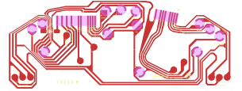

# Kancil Instrument Cluster PCB — VDO 73230E

KiCad reverse-engineering project for the **VDO 73230E** dashboard meter flex PCB found in the Perodua Kancil.

> [!IMPORTANT]
> Must be ordered as a **flex PCB**. The board bends to form the edge connectors and to reach the recessed mounting bolts of the temperature and fuel gauges.

## Compatibility

**M/T (manual transmission) Perodua Kancil**, square-lamp models ("lampu petak"):

| Generation | Years |
|---|---|
| Kancil 660 | 1994–1997 |
| Kancil 850 | 1997–2000 |
| Kancil EX/GX | 2000–2002 |

> [!CAUTION]
> Not compatible with 2002–2009 round-lamp models ("lampu bulat").

## PCB Preview




## Progress

- [x] Board scan (600 DPI, both sides)
- [x] Image deskew and alignment
- [x] Board outline — holes, connector fingers, grid-aligned
- [x] Copper — connector pads, bulb pads, gauge pads
- [x] Silkscreen — board text and labels
- [x] Copper traces
- [x] CHARGE lamp pad repair *(see Notes)*
- [x] CHARGE lamp diode through-hole pads *(see Notes)*
- [ ] Fabrication *(in progress)*
- [ ] Test fit
- [ ] Electrical test
- [ ] Functionality test

## Notes

### Approach

The schematic is intentionally left blank. Reconstruction is done entirely in the PCB editor — shapes, lines, and polygons drawn directly on copper and silkscreen layers. KiCad routed traces cannot cleanly follow the freeform curves of the original flex PCB artwork. Silkscreen text is on the silkscreen layer rather than copper as on the original, which has no electrical consequence.

### Connectors

The board has two connectors. Each flex edge folds into a recessed housing moulded into the back of the meter body. The mating connector models are unconfirmed — close-up photos of the wiring harness or the service manual would be needed to identify them.

### CHARGE Lamp

One pad detached from the original board due to adhesive failure; its position is legible from the scan and should be straightforward to restore. Through-hole pads for a CHARGE lamp diode also need to be added.

## Ideas / Stretch Goals

- Replace bulbs with 12V-native addressable RGB LEDs (e.g. WS2815) via an automotive-rated 12V LDO — enables per-zone colour control, software dimming, and ambient-light-responsive brightness
- MCU with Wi-Fi/BLE for telemetry or CAN bus emulation (e.g. nRF52, ESP32)
- Shift light / rev alert at a configurable RPM threshold
- Battery voltage monitoring via RGB LED colour coding
- Custom warning indicators (oil pressure, coolant temp, etc.) using traffic-light colours in the RGB backlight
- Hall effect sensor on the speedo cable for wheel speed signal acquisition
- Reverse engineer the tachometer PCB

## Repository Contents

```
references/
  vdo-73230-e-pcb-scan-600dpi.pdf   600 DPI flatbed scan of both sides
  vdo-73230-e-front-deskew.png      deskewed front (alpha-masked)
  vdo-73230-e-back-deskew.png       deskewed back (alpha-masked)
  vdo-73230-e-pcb-preview.svg       KiCad PCB editor export

kancil-meter-vdo-73230-e.kicad_pro  KiCad project file
kancil-meter-vdo-73230-e.kicad_pcb  PCB layout
kancil-meter-vdo-73230-e.kicad_sch  Schematic (blank)
```

## License

[CERN Open Hardware Licence Version 2 — Strongly Reciprocal (CERN-OHL-S-2.0)](LICENSE)
